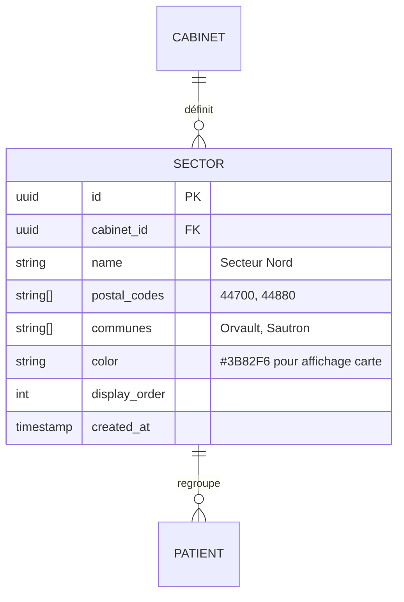

# MISE À JOUR ARCHITECTURE — Refonte optimisation de tournées
## Addendum à 02-architecture-backend.md v1.0

**Version :** 1.1
**Date :** Février 2026
**Raison :** L'approche initiale (réordonnancement VRPTW des RDV existants) ne correspond pas au workflow réel des IDEL. Les RDV une fois donnés aux patients ne peuvent pas être réordonnés.

---

## CONSTAT : POURQUOI L'APPROCHE VRPTW CLASSIQUE NE MARCHE PAS

L'implémentation initiale supposait qu'on pouvait prendre les N RDV du jour et trouver l'ordre de visite optimal. En réalité :

1. **Les horaires sont engagés auprès des patients.** Mme Dupont attend son pansement à 9h. On ne peut pas lui dire la veille "finalement ce sera 14h".
2. **L'ordre de passage découle des horaires.** Si le RDV de 9h est à Sautron et celui de 10h30 à Orvault, l'ordre est imposé.
3. **La vraie optimisation se fait EN AMONT**, au moment où on choisit le créneau d'un nouveau RDV — pas après coup.

## WORKFLOW RÉEL VALIDÉ AVEC DOMAIN EXPERT

### Comment une IDEL construit sa journée

**Socle fixe (patients chroniques ~60-70% de la journée) :**
- Mêmes patients, mêmes créneaux, même fréquence (quotidien, 3×/sem, hebdo, etc.)
- Créneaux stables d'une semaine à l'autre (Mme Dupont = toujours 9h)
- Déplaçables exceptionnellement si le traitement le permet et le patient est prévenu

**Ajouts au fil de l'eau (nouveaux RDV ~30-40%) :**
- Patient appelle → IDEL cherche un créneau qui "s'insère bien" dans la journée
- "S'insère bien" = proche géographiquement des RDV adjacents + dans les plages libres
- L'IDEL raisonne par secteurs géographiques : "le matin je suis sur Sautron/Orvault, l'après-midi sur Nantes centre"

**Deux types de flexibilité horaire :**
- **Domicile** : tranche de 30 min (ex: "entre 9h00 et 9h30") — le patient sait que l'IDEL arrive dans cette fenêtre
- **Cabinet** : horaire fixe (ex: "10h00") — le patient vient au cabinet à l'heure dite

**Logique géographique :**
- Les tournées couvrent plusieurs communes
- Les IDEL regroupent intuitivement les RDV par zone géographique dans des plages horaires
- Ex: 8h-10h = secteur Nord (Orvault, Sautron), 10h30-12h = secteur Est (Carquefou), 14h-17h = Nantes centre

---

## ADR-008 : Moteur de suggestion de créneaux (pas de réordonnancement)

**Contexte :** Les RDV une fois donnés aux patients sont des engagements. L'optimisation post-hoc (VRPTW) n'a pas de valeur. La vraie valeur est d'aider l'IDEL à choisir le meilleur créneau pour un nouveau RDV.

**Options considérées :**
- VRPTW classique (réordonnancement) — **rejeté**, ne correspond pas au métier
- Moteur de suggestion de créneaux avec scoring géographique — **retenu**
- Pas d'optimisation, juste un affichage carte — insuffisant

**Décision :** Implémenter un **moteur de suggestion de créneaux** qui, pour un nouveau RDV demandé, analyse la journée existante et propose les 3 meilleurs créneaux classés par pertinence (proximité géographique + temps de trajet minimal).

**Fonctionnement :**
```
Input :
- Journée existante : liste des RDV déjà planifiés (avec horaires et lieux)
- Nouveau besoin : patient (localisation), type de soin (durée), jour souhaité
- Contraintes IDEL : horaires de travail, pause déjeuner, secteurs habituels

Output :
- Top 3 créneaux suggérés, chacun avec :
  - Horaire proposé (début-fin)
  - Détour engendré en km et minutes par rapport au trajet direct entre RDV adjacents
  - Secteur géographique (commune/zone)
  - Score de pertinence (combinaison distance + cohérence secteur + confort horaire)
```

**Algorithme de scoring :**
Pour chaque "trou" dans la journée entre deux RDV consécutifs (A à heure_A et B à heure_B) :
1. Calculer si le nouveau RDV (durée D) tient dans le trou : heure_A + durée_A + trajet_A→new + D + trajet_new→B ≤ heure_B
2. Calculer le détour : (trajet_A→new + trajet_new→B) - trajet_A→B
3. Scorer : score = w1 × (1 / détour_km) + w2 × (1 si même commune que voisins, 0 sinon) + w3 × confort_horaire
4. Retourner les 3 meilleurs trous

**Ce qu'on garde d'OR-Tools :** On ne l'utilise plus pour le VRPTW, mais il peut servir pour calculer la matrice de distances de manière efficace. Alternativement, on peut se contenter d'OpenRouteService ou du calcul Haversine.

**Conséquence :** Le code est plus simple que le VRPTW. Pas besoin de solver combinatoire — c'est un algorithme d'insertion gloutonne avec scoring. Plus facile à implémenter, à tester et à expliquer aux utilisateurs.

---

## ADR-009 : Secteurs géographiques

**Contexte :** Les IDEL raisonnent par zones/secteurs pour regrouper les visites. C'est une notion clé pour la qualité des suggestions.

**Décision :** Introduire une entité `Sector` (secteur géographique) configurable par cabinet, avec rattachement automatique des patients à un secteur basé sur leur commune ou code postal.

**Implémentation MVP :**
- Un secteur = un label + une liste de communes ou codes postaux
- Ex: "Secteur Nord" = [44700 Orvault, 44880 Sautron]
- Le rattachement patient → secteur est automatique (par code postal) avec override manuel possible
- La suggestion de créneaux utilise le secteur pour scorer la cohérence géographique

**Implémentation future :**
- Clustering automatique des patients par k-means géographique
- Détection de patterns de tournée (ML sur l'historique)
- Zones dynamiques qui s'adaptent à l'évolution de la patientèle

---

## MODIFICATIONS DU MODÈLE DE DONNÉES

### Nouvelles entités



### Modifications sur entités existantes

**Patient** — ajouts :
```
sector_id       UUID FK → sectors(id)    -- Secteur géographique (auto ou manuel)
postal_code     VARCHAR(10)              -- Code postal (en clair, pour rattachement secteur)
city            VARCHAR(100)             -- Commune (en clair, pour rattachement secteur)
```
Note : `postal_code` et `city` restent en clair car non identifiants seuls et nécessaires pour le rattachement secteur et les requêtes géographiques.

**Appointment** — ajouts :
```
location_type   VARCHAR(20) DEFAULT 'home'    -- 'home' (domicile) | 'office' (cabinet)
time_window_start   TIME                       -- Début de la tranche horaire donnée au patient
time_window_end     TIME                       -- Fin de la tranche horaire
```
Pour un RDV cabinet (location_type='office') : time_window_start = time_window_end = horaire fixe.
Pour un RDV domicile (location_type='home') : fenêtre de 30 min (ex: 9h00-9h30).

**Tournee** — repensée :
La tournée n'est plus le résultat d'une optimisation VRPTW. C'est la **photo de la journée planifiée** d'une IDEL, avec les métriques de trajet. Elle sert à :
- Visualiser la journée sur une carte
- Calculer les distances et durées totales
- Comparer avec ce qui aurait été fait sans l'outil (estimation)
- Historiser pour les statistiques

```
TOURNEE {
    uuid id PK
    uuid cabinet_id FK
    uuid idel_id FK
    date tournee_date
    string status "planned|in_progress|completed"
    float total_distance_km           -- Distance totale planifiée
    float total_duration_minutes      -- Durée totale (trajets + soins)
    float travel_time_minutes         -- Temps de trajet seul (hors soins)
    int num_stops
    jsonb start_location              -- Domicile/cabinet IDEL
    jsonb end_location
    timestamp created_at
}
```
Note : on retire `savings_km` et `savings_minutes` de la tournée elle-même. Les savings seront calculés à la volée dans les stats en comparant la distance réelle aux distances "naïves" (ordre alphabétique ou chronologique de prise de RDV).

**TourneeStop** — simplifié :
```
TOURNEE_STOP {
    uuid id PK
    uuid tournee_id FK
    uuid appointment_id FK
    int stop_order
    timestamp planned_arrival         -- Heure d'arrivée planifiée
    timestamp actual_arrival          -- Heure d'arrivée réelle (rempli par l'IDEL)
    float distance_from_previous_km
    int travel_time_from_previous_min
    string status "pending|arrived|completed|skipped"
}
```

### Nouvelle entité : SlotSuggestion (pas persistée, DTO uniquement)

Cette entité n'est pas en base — c'est un objet retourné par le moteur de suggestion :
```python
@dataclass
class SlotSuggestion:
    rank: int                          # 1, 2, 3
    start_time: datetime.time          # Début du créneau suggéré
    end_time: datetime.time            # Fin du créneau
    previous_appointment: Appointment | None  # RDV juste avant dans la journée
    next_appointment: Appointment | None      # RDV juste après
    detour_km: float                   # Détour par rapport au trajet direct
    detour_minutes: float
    same_sector: bool                  # Le patient est dans le même secteur que les voisins
    sector_name: str | None
    score: float                       # Score composite (0-100)
    explanation: str                   # "Proche de Mme Dupont (9h30, 800m)"
```

---

## MODIFICATIONS DES RÈGLES MÉTIER (domain/rules/)

### Nouveau fichier : slot_suggestion_rules.py

```python
"""
Règles métier pour la suggestion de créneaux.
Encode la logique intuitive que les IDEL utilisent pour placer un nouveau RDV.
"""

def find_available_slots(
    existing_appointments: list[Appointment],
    new_patient_location: tuple[float, float],
    new_care_duration_minutes: int,
    new_location_type: str,  # 'home' | 'office'
    work_start: datetime.time,
    work_end: datetime.time,
    lunch_start: datetime.time,
    lunch_duration: int,
    min_travel_time_minutes: int = 5,  # Temps minimum entre 2 patients
) -> list[SlotSuggestion]:
    """
    Trouve les créneaux disponibles dans une journée pour un nouveau RDV.
    
    Algorithme :
    1. Trier les RDV existants par heure
    2. Identifier les "trous" : avant le 1er RDV, entre chaque paire, après le dernier
    3. Pour chaque trou, vérifier si le nouveau RDV + trajets tient dedans
    4. Scorer chaque trou et retourner le top 3
    """
    ...

def calculate_detour(
    prev_location: tuple[float, float] | None,
    new_location: tuple[float, float],
    next_location: tuple[float, float] | None,
) -> tuple[float, float]:
    """
    Calcule le détour engendré par l'insertion d'un nouveau point entre deux points.
    Retourne (detour_km, detour_minutes).
    
    Détour = (dist_prev→new + dist_new→next) - dist_prev→next
    Si prev ou next est None (début/fin de journée), le détour est juste le trajet aller.
    """
    ...

def score_slot(
    detour_km: float,
    detour_minutes: float,
    same_sector: bool,
    time_preference_match: bool,  # Le patient préfère matin/après-midi et le créneau correspond
    gap_comfort_minutes: float,   # Temps "mort" restant (ni trop serré ni trop de vide)
) -> float:
    """
    Score composite (0-100) pour un créneau.
    
    Pondération :
    - 40% : minimisation du détour (inversement proportionnel à la distance)
    - 25% : cohérence secteur géographique (bonus si même secteur)
    - 20% : préférence horaire du patient (matin/après-midi)
    - 15% : confort de marge (ni trop serré < 5min, ni trop de vide > 45min)
    """
    ...

def check_slot_fits(
    slot_start: datetime.time,
    slot_end: datetime.time,
    new_duration_minutes: int,
    travel_to_minutes: float,
    travel_from_minutes: float,
    min_buffer_minutes: int = 5,
) -> bool:
    """Vérifie qu'un nouveau RDV + trajets tient dans un créneau libre."""
    ...
```

### Modifications : tournee_rules.py

Remplacer les règles VRPTW par :

```python
def build_daily_schedule(
    appointments: list[Appointment],
    idel_start_location: tuple[float, float],
) -> list[TourneeStop]:
    """
    Construit la tournée du jour à partir des RDV planifiés.
    L'ordre est déterminé par les horaires (pas par optimisation).
    Calcule les distances et temps de trajet entre chaque stop.
    """
    ...

def estimate_daily_metrics(
    stops: list[TourneeStop],
) -> dict:
    """
    Calcule les métriques de la journée :
    - distance totale, temps de trajet total, temps de soins total
    - identification des "trajets longs" (> 15 min) qui pourraient être optimisés
    """
    ...

def detect_scheduling_inefficiencies(
    stops: list[TourneeStop],
    sectors: list[Sector],
) -> list[str]:
    """
    Détecte les allers-retours inutiles dans la journée planifiée.
    Ex: "Vous passez à Orvault à 9h, Nantes à 10h, puis retour à Orvault à 11h.
    Si Mme Martin (11h) pouvait être décalée à 9h30, vous gagneriez 8 km."
    
    Retourne une liste de suggestions d'amélioration (pas d'action automatique).
    """
    ...
```

---

## MODIFICATIONS DES CONTRATS D'API

### Remplacement des endpoints tournées

```yaml
# === SUPPRIMÉ ===
# POST /api/v1/tournees/optimize     -- N'a plus de sens
# POST /api/v1/tournees/{id}/reoptimize  -- Idem

# === NOUVEAU : Suggestion de créneaux ===

POST   /api/v1/slots/suggest
  Body: {
    date: "2026-02-20",
    patient_id: uuid,                     # Patient concerné (pour sa localisation)
    care_type: "pansement",
    duration_minutes: 20,
    location_type: "home",                # 'home' | 'office'
    idel_id?: uuid,                       # Si cabinet avec plusieurs IDEL
    preferred_slot?: "morning"            # 'morning' | 'afternoon' | 'any'
  }
  Response: 200 {
    suggestions: [
      {
        rank: 1,
        start_time: "10:10",
        end_time: "10:40",
        detour_km: 0.8,
        detour_minutes: 3,
        same_sector: true,
        sector_name: "Secteur Nord",
        score: 87,
        explanation: "Proche de Mme Dupont (9h30, Orvault, 800m). Même secteur.",
        previous_appointment: {patient_name: "Mme Dupont", time: "09:30", city: "Orvault"},
        next_appointment: {patient_name: "M. Martin", time: "11:00", city: "Sautron"}
      },
      { rank: 2, ... },
      { rank: 3, ... }
    ],
    day_summary: {
      existing_appointments: 6,
      free_slots_found: 3,
      busiest_sector: "Secteur Nord",
      total_planned_km: 34.5
    }
  }

POST   /api/v1/slots/suggest/{suggestion_rank}/book
  Body: {
    date: "2026-02-20",
    patient_id: uuid,
    care_type: "pansement",
    duration_minutes: 20,
    location_type: "home",
    time_window_start: "10:10",
    time_window_end: "10:40"
  }
  Response: 201 Appointment
  Note: Crée le RDV avec le créneau choisi. Raccourci pour éviter de re-saisir les infos.

# === MODIFIÉ : Tournées (consultation, pas optimisation) ===

GET    /api/v1/tournees/today
  Query: ?idel_id=uuid
  Response: 200 {
    tournee: Tournee (avec stops ordonnés chronologiquement),
    map_data: {                           # Données pour affichage carte
      stops: [{lat, lon, patient_name, time, care_type, sector_color}],
      route_polyline: "...",              # Tracé du trajet
      sectors: [{name, color, patient_count}]
    },
    metrics: {
      total_distance_km: 34.5,
      total_travel_minutes: 68,
      total_care_minutes: 180,
      num_sectors: 3,
      longest_leg_km: 8.2,
      longest_leg_label: "Sautron → Nantes centre"
    },
    inefficiencies: [                     # Suggestions d'amélioration (informatif)
      "Aller-retour Orvault détecté : 9h Orvault, 10h Nantes, 11h Orvault (+8 km)"
    ]
  }

POST   /api/v1/tournees/{id}/stops/{stop_id}/arrive
  Response: 200 TourneeStop (actual_arrival enregistré)

GET    /api/v1/tournees/stats
  Query: ?from=2026-01-01&to=2026-02-20
  Response: 200 {
    period_days: 51,
    total_distance_km: 1845,
    avg_daily_distance_km: 36.2,
    avg_daily_travel_minutes: 72,
    avg_patients_per_day: 8.3,
    most_visited_sector: "Secteur Nord",
    suggestions_accepted: 45,            # Combien de fois le créneau suggéré a été pris
    suggestions_total: 62
  }

# === NOUVEAU : Secteurs géographiques ===

GET    /api/v1/sectors
  Response: 200 [Sector]

POST   /api/v1/sectors
  Body: {name, postal_codes: ["44700", "44880"], color?: "#3B82F6"}
  Response: 201 Sector

PATCH  /api/v1/sectors/{id}
  Body: {name?, postal_codes?, color?}
  Response: 200 Sector

DELETE /api/v1/sectors/{id}
  Response: 204
```

---

## PROMPT 4 RÉÉCRIT — Suggestion de créneaux

Remplace entièrement le Prompt 4 dans `docs/10-methodo-prompts.md` par :

```
Consulte docs/02-architecture-backend.md et docs/02b-architecture-tournees.md.
On implémente le moteur de suggestion de créneaux et la visualisation des tournées.

=== CONTEXTE MÉTIER ===

Les IDEL ne réordonnent JAMAIS leurs RDV une fois planifiés. L'optimisation se fait
EN AMONT : quand un nouveau patient appelle, on suggère le créneau qui minimise
les détours et respecte la cohérence géographique par secteurs.

=== DOMAIN (domain/rules/slot_suggestion_rules.py) ===

Implémente les fonctions suivantes (voir docs/02b-architecture-tournees.md
pour les signatures détaillées) :

- find_available_slots() : trouve les trous dans la journée et évalue chacun
- calculate_detour() : calcule le détour engendré par l'insertion d'un point
- score_slot() : score composite (détour 40%, secteur 25%, préférence horaire 20%, confort 15%)
- check_slot_fits() : vérifie qu'un RDV + trajets tient dans un trou

L'algorithme de find_available_slots :
1. Trier les RDV existants par time_window_start
2. Ajouter un "RDV virtuel" début de journée (work_start, à start_location)
   et fin de journée (work_end, à end_location)
3. Pour chaque paire consécutive (A, B), calculer le temps disponible :
   available = B.time_window_start - (A.time_window_end + travel_A_to_new + new_duration + travel_new_to_B)
4. Si available >= 0, c'est un trou viable → calculer detour et score
5. Exclure les trous qui chevauchent la pause déjeuner
6. Trier par score décroissant, retourner top 3

Pour les calculs de distance, utiliser le RoutingService (interface domain).
En dev/test, le FakeRoutingService (Haversine × 1.4) suffit.

=== DOMAIN (domain/entities/) ===

Ajouter/modifier :
- Sector(id, cabinet_id, name, postal_codes: list[str], communes: list[str], color, display_order)
- Patient : ajouter sector_id, postal_code, city
- Appointment : ajouter location_type ('home'|'office'), time_window_start, time_window_end

=== DOMAIN (domain/rules/tournee_rules.py) ===

Remplacer les anciennes règles VRPTW par :
- build_daily_schedule() : construit les stops ordonnés chronologiquement
- estimate_daily_metrics() : calcule distances, durées
- detect_scheduling_inefficiencies() : détecte les allers-retours inutiles

=== INFRASTRUCTURE ===

Persistence :
- SectorModel + migration Alembic
- Modifier PatientModel (ajouter sector_id, postal_code, city) + migration
- Modifier AppointmentModel (ajouter location_type, time_window_start, time_window_end) + migration
- SQLAlchemy repository pour Sector (CRUD simple)

API Routes :
- POST /api/v1/slots/suggest (voir contrat API dans 02b-architecture-tournees.md)
- POST /api/v1/slots/suggest/{rank}/book (crée le RDV depuis la suggestion)
- GET /api/v1/tournees/today (journée avec carte et métriques)
- CRUD /api/v1/sectors

Schemas Pydantic :
- SlotSuggestRequest, SlotSuggestionResponse, DaySummary
- SectorCreate, SectorResponse
- TourneeDetailResponse (avec map_data et metrics)

=== USE CASE (application/use_cases/) ===

suggest_slot.py :
1. Récupère les appointments du jour pour l'IDEL
2. Récupère la localisation du patient (déchiffrée)
3. Récupère les secteurs du cabinet
4. Appelle find_available_slots() avec le RoutingService
5. Retourne les suggestions avec explications

build_tournee.py :
1. Récupère les appointments du jour
2. Construit la tournée (ordonnée chronologiquement)
3. Calcule les métriques
4. Détecte les inefficacités
5. Sauvegarde la tournée si elle n'existe pas déjà
6. Retourne les données de carte

=== DÉMO (scripts/demo_suggestion.py) ===

Crée un script qui :
1. Crée 3 secteurs pour l'agglomération nantaise :
   - "Secteur Nord" : Orvault (44700), Sautron (44880) — couleur bleue
   - "Secteur Est" : Carquefou (44470), Sainte-Luce (44980) — couleur verte
   - "Nantes Centre" : Nantes (44000, 44100, 44200, 44300) — couleur rouge
2. Crée 6 patients chroniques avec des RDV déjà planifiés :
   - 8h00 Mme Durand, Orvault (insuline)
   - 8h45 M. Petit, Orvault (pansement)
   - 9h30 Mme Martin, Sautron (BSI)
   - 11h00 M. Bernard, Nantes centre (injection)
   - 14h00 Mme Lefebvre, Nantes centre (pansement)
   - 15h30 M. Moreau, Nantes centre (prélèvement)
3. Simule un appel : nouveau patient à Sautron (44880) a besoin d'un pansement
   → Appelle le moteur de suggestion
   → Affiche les 3 suggestions avec scores et explications
4. Génère une carte HTML (Folium) montrant :
   - Les patients existants (marqueurs colorés par secteur)
   - Les 3 créneaux suggérés (marqueurs en pointillés avec numéro de rang)
   - Les secteurs en zones colorées semi-transparentes
   - Un panneau latéral avec les détails des suggestions

=== TESTS ===

tests/unit/test_slot_suggestion.py :
- Test avec journée vide → le créneau suggéré est en début de journée
- Test insertion entre 2 RDV proches géographiquement → score élevé
- Test insertion entre 2 RDV éloignés → détour important, score bas
- Test pause déjeuner respectée → pas de suggestion entre 12h et 13h
- Test patient même secteur que voisins → bonus de score
- Test journée pleine → aucune suggestion (retourne liste vide)
- Test RDV cabinet (horaire fixe) vs domicile (fenêtre 30 min)

tests/unit/test_tournee_rules.py :
- Test build_daily_schedule ordonne bien par horaire
- Test detect_scheduling_inefficiencies détecte un aller-retour
- Test estimate_daily_metrics calcule correctement distances et durées
```

---

## REVIEW 4 RÉÉCRITE

Remplace la Review 4 dans `docs/11-methodo-reviews.md` par :

```
Tu es un product manager avec expertise en optimisation logistique.
Audite le moteur de suggestion de créneaux et la visualisation des tournées.

Consulte docs/02b-architecture-tournees.md pour les exigences.

=== RÈGLE MÉTIER FONDAMENTALE ===
- [ ] CRITIQUE : Aucune partie du code ne réordonne des RDV existants
- [ ] Le moteur suggère des créneaux pour de NOUVEAUX RDV uniquement
- [ ] Les RDV existants sont traités comme des contraintes fixes

=== ALGORITHME DE SUGGESTION ===

- [ ] find_available_slots identifie correctement les trous entre RDV
- [ ] La pause déjeuner est exclue des suggestions
- [ ] Le calcul de détour est correct : (A→new + new→B) - A→B
- [ ] Le scoring pondère : détour 40%, secteur 25%, préférence horaire 20%, confort 15%
- [ ] Les suggestions sont triées par score décroissant
- [ ] Maximum 3 suggestions retournées
- [ ] Si aucun créneau ne tient → retourne liste vide avec message explicatif
- [ ] Les horaires suggérés respectent les horaires de travail de l'IDEL

Cas limites :
- [ ] Journée vide → suggère en début de matinée
- [ ] Un seul RDV existant → 2 trous (avant et après)
- [ ] Patient sans coordonnées → erreur claire, pas de crash
- [ ] Durée de soin > trou disponible → ce trou n'est pas proposé

=== LOCATION TYPE ===
- [ ] RDV 'home' : time_window de 30 min (ex: 9h00-9h30)
- [ ] RDV 'office' : time_window_start = time_window_end (horaire fixe)
- [ ] La suggestion adapte la fenêtre selon le location_type

=== SECTEURS ===
- [ ] Les patients sont rattachés automatiquement à un secteur via postal_code
- [ ] Le bonus secteur dans le score fonctionne (même secteur que RDV adjacents)
- [ ] CRUD secteurs fonctionne (create, list, update, delete)
- [ ] Un patient sans secteur ne cause pas de crash

=== TOURNÉE DU JOUR ===
- [ ] GET /tournees/today retourne les stops dans l'ORDRE CHRONOLOGIQUE (pas optimisé)
- [ ] Les métriques sont réalistes (distance totale, temps trajet)
- [ ] detect_scheduling_inefficiencies identifie les allers-retours
- [ ] Les suggestions d'amélioration sont informatives, pas des actions automatiques

=== DÉMO ===
- [ ] La carte affiche les 3 secteurs en couleurs distinctes
- [ ] Les patients existants et les suggestions sont bien visibles
- [ ] L'explication de chaque suggestion est compréhensible par une IDEL non technique
- [ ] Les distances et temps affichés sont réalistes pour Nantes

Pour chaque problème, donne sévérité, fichier, et correction.
```
