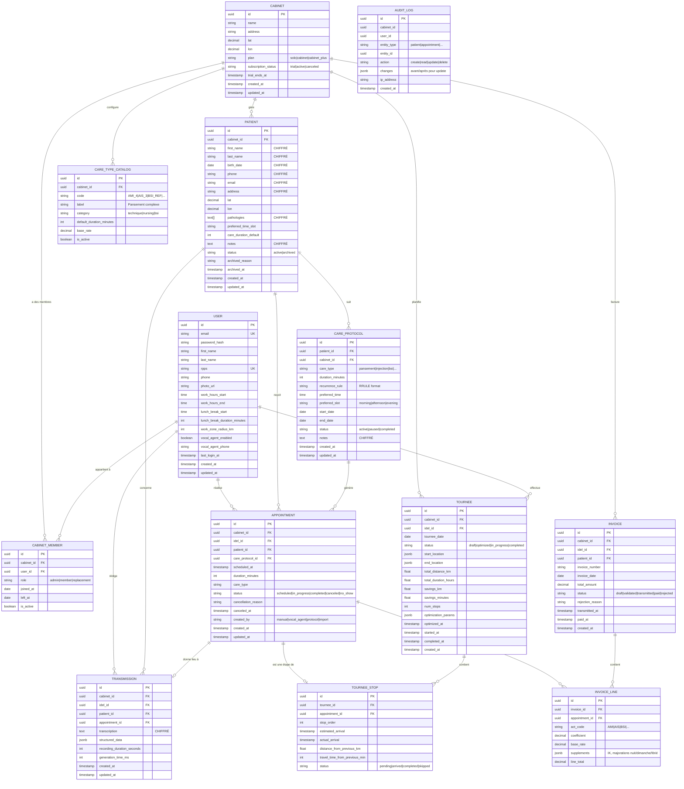

# ARCHITECTURE TECHNIQUE — ASSISTANT IA IDEL
## Document d'architecture, modèle de données et décisions techniques

**Version :** 1.0
**Date :** Février 2026
**Auteur :** Cyrille (Tech Lead)
**Basé sur :** PRD v1.0, Developer Setup Guide v1.0, Business Plan

---

## TABLE DES MATIÈRES

1. [Analyse de l'existant et problèmes identifiés](#1-analyse-de-lexistant)
2. [Architecture Decision Records (ADR)](#2-adr)
3. [Modèle de données revu](#3-modèle-de-données)
4. [Architecture applicative (Clean Architecture)](#4-architecture-applicative)
5. [Contrats d'API MVP](#5-contrats-api)
6. [Stratégie de chiffrement](#6-chiffrement)
7. [Prompts Claude Code enrichis](#7-prompts-claude-code)

---

## 1. ANALYSE DE L'EXISTANT ET PROBLÈMES IDENTIFIÉS

Le PRD et le Developer Setup Guide posent une bonne base, mais l'analyse détaillée révèle **7 problèmes structurels** à résoudre avant de coder.

### 1.1 Absence de l'entité Cabinet

Le PRD décrit trois personas (Solo, Cabinet 3 IDEL, Grand Cabinet 8 IDEL) et trois plans tarifaires (Solo, Cabinet, Cabinet+). Pourtant, le modèle de données n'a **aucune table `cabinet`**. La table `patients` pointe directement vers `users` (IDEL) via `idel_id`.

**Conséquence :** En l'état, impossible de partager des patients entre IDEL du même cabinet. Si Sophie du cabinet de Lyon crée un patient, ses collègues ne le voient pas. C'est un problème bloquant pour les plans Cabinet et Cabinet+.

**Solution :** Ajouter une entité `Cabinet` comme pivot central. Les patients appartiennent au cabinet, pas à une IDEL individuelle. Les IDEL sont membres d'un cabinet avec des rôles. Le RLS filtre par `cabinet_id`, pas par `idel_id`.

### 1.2 Pas de gestion des soins récurrents

Les IDEL visitent les mêmes patients quotidiennement ou plusieurs fois par semaine (insuline, pansements, BSI). Le modèle actuel ne gère que des RDV unitaires — pas de récurrence.

**Conséquence :** Pour un patient vu 7j/7 pour de l'insuline, il faudrait créer 365 RDV manuellement par an. Inacceptable.

**Solution :** Ajouter une entité `CareProtocol` (protocole de soins) qui définit la récurrence et génère automatiquement les `Appointment` associés.

### 1.3 Pas d'entité Tournée persistante

L'endpoint `POST /tournees/optimiser` retourne un résultat mais rien ne persiste en base. On ne peut pas : consulter une tournée passée, mesurer les gains km cumulés, suivre l'exécution de la tournée en cours.

**Solution :** Ajouter une entité `Tournee` qui stocke le résultat d'optimisation, et un lien `TourneeStop` entre tournée et appointments.

### 1.4 Architecture "services" trop plate

La structure actuelle met toute la logique métier dans `services/`. Pas de séparation entre logique métier pure (règles IDEL, contraintes horaires) et intégrations externes (API routing, Whisper, Mistral). Si demain on change de provider de routing ou de LLM, il faut toucher au code métier.

**Solution :** Adopter une architecture en couches avec ports/adapters (hexagonale simplifiée).

### 1.5 Audit trail absent

La certification HDS exige un audit trail complet : qui a accédé à quelle donnée, quand, quelle modification. Le modèle actuel n'a que `created_at` et `updated_at`, ce qui est insuffisant.

**Solution :** Ajouter une table `audit_log` et un mécanisme automatique de journalisation.

### 1.6 Isolation multi-tenant incomplète

Le RLS actuel filtre par `idel_id` (utilisateur individuel). Mais pour un cabinet, on veut que toutes les IDEL du cabinet voient les mêmes patients. Il faut un RLS par `cabinet_id`.

### 1.7 Gestion des actes NGAP absente

La facturation est listée dans le MVP mais le modèle de données n'a pas de table de référence des actes (AMI, AIS, BSI, IK, majorations). Sans ça, impossible de calculer les montants ou de pré-remplir les factures.

**Solution :** Ajouter une table de référence `care_type_catalog` et une entité `Invoice`/`InvoiceLine`.

---

## 2. ARCHITECTURE DECISION RECORDS (ADR)

### ADR-001 : PostgreSQL comme base de données unique

**Contexte :** Le projet manipule des données relationnelles (patients, RDV, factures) avec des contraintes de géolocalisation et de conformité HDS.

**Options considérées :**
- PostgreSQL seul (avec PostGIS, pg_trgm, JSONB)
- PostgreSQL + MongoDB (documents transmissions)
- SQLite en dev + PostgreSQL en prod

**Décision :** PostgreSQL 16 uniquement.

**Justification :**
- PostGIS couvre les besoins géo (calcul distances, zones)
- JSONB suffit pour les données semi-structurées (structured_data transmissions)
- pg_trgm pour la recherche full-text (noms patients)
- Une seule base = une seule sauvegarde, un seul point de conformité HDS
- SQLAlchemy async supporte très bien PostgreSQL via asyncpg

**Conséquence :** Pas de MongoDB. Les transmissions structurées utilisent des colonnes JSONB.

---

### ADR-002 : Clean Architecture simplifiée (3 couches)

**Contexte :** Le projet va évoluer significativement (MVP → V1.0 → V1.5) avec changements de providers IA, ajout de canaux (web, mobile, vocal), et contraintes réglementaires croissantes.

**Options considérées :**
- Architecture plate (routes → services → models) — PRD actuel
- Clean Architecture complète (Domain, Application, Infrastructure, Presentation)
- Clean Architecture simplifiée (3 couches)

**Décision :** Architecture 3 couches : Domain, Application, Infrastructure.

**Justification :**
- L'architecture plate actuelle mélange logique métier et accès externe dans `services/`
- La Clean Architecture complète (4+ couches) est over-engineering pour un projet solo
- 3 couches donnent la séparation nécessaire sans complexité excessive :
  - **Domain** : entités, value objects, interfaces de repository, règles métier pures
  - **Application** : use cases (orchestration), DTOs
  - **Infrastructure** : FastAPI routes, SQLAlchemy repos, clients API externes, chiffrement

**Conséquence :** La logique métier (ex: "un patient ne peut avoir 2 RDV au même horaire") vit dans Domain et n'importe aucune dépendance externe. Les providers IA (Mistral, Whisper) sont derrière des interfaces, interchangeables.

---

### ADR-003 : Multi-tenant par Cabinet (pas par User)

**Contexte :** Les plans Cabinet et Cabinet+ nécessitent le partage de données entre IDEL du même cabinet.

**Options considérées :**
- RLS par `user_id` (modèle actuel) + requêtes manuelles pour cabinet
- RLS par `cabinet_id` dès le départ
- Schema par cabinet (isolation physique)

**Décision :** RLS par `cabinet_id`. Un utilisateur Solo crée automatiquement un cabinet à 1 membre.

**Justification :**
- Schema par cabinet = trop complexe pour les migrations, pas adapté à l'échelle
- RLS par user = ne gère pas le partage cabinet
- RLS par cabinet + rôles applicatifs = bon équilibre sécurité/flexibilité
- Un Solo est juste un cabinet à 1 membre — modèle unifié

**Conséquence :** Toutes les entités métier portent un `cabinet_id`. Le middleware FastAPI injecte le `cabinet_id` dans la session PostgreSQL pour le RLS.

---

### ADR-004 : OVH souverain + OVH Telecom (pas Twilio)

**Contexte :** Données de santé soumises à HDS + RGPD. Twilio est américain (Cloud Act).

**Décision :** Infrastructure 100% OVH Public Cloud. Téléphonie via OVH Telecom (SIP français) au lieu de Twilio.

**Justification (déjà validée dans conversation précédente) :**
- OVH = hébergeur HDS certifié, données en France
- OVH Telecom = opérateur français, pas soumis au Cloud Act
- Coût comparable, souveraineté garantie

**Conséquence :** L'agent vocal utilisera OVH Telecom SIP + Mistral API (UE). L'adapter Twilio est quand même codé (interface commune) au cas où.

---

### ADR-005 : Chiffrement applicatif AES-256 pour données sensibles

**Contexte :** HDS exige le chiffrement des données de santé au repos. PostgreSQL TDE (Transparent Data Encryption) chiffre le disque, mais ne protège pas contre un accès SQL direct.

**Décision :** Double chiffrement — TDE PostgreSQL (disque) + chiffrement applicatif AES-256-GCM (colonnes sensibles).

**Colonnes chiffrées :**
- `patients.first_name`, `patients.last_name`, `patients.phone`, `patients.email`, `patients.address`, `patients.birth_date`, `patients.pathologies`, `patients.notes`
- `transmissions.transcription`
- `vocal_agent_calls.transcription`, `vocal_agent_calls.caller_phone`

**Colonnes NON chiffrées (nécessaires pour requêtes) :**
- `patients.lat`, `patients.lon` (géolocalisation pour optimisation — données non identifiantes seules)
- `patients.status`, `patients.preferred_time_slot`, `patients.care_duration_default`
- `appointments.*` (pas de données de santé directes, juste scheduling)
- Tous les `id`, `cabinet_id`, timestamps

**Mécanisme :** Chiffrement/déchiffrement transparent via des properties Python sur les modèles SQLAlchemy. Clé par cabinet stockée dans Vault (prod) ou fichier chiffré (dev).

---

### ADR-006 : Whisper self-hosted sur GPU OVH (pas API OpenAI)

**Contexte :** La transcription envoie de l'audio contenant des données médicales identifiantes. L'API OpenAI Whisper enverrait ces données aux USA.

**Décision :** Whisper Large-v3 self-hosted sur GPU OVH (T1-45 ou équivalent) pour le MVP. Fallback sur Whisper via API Mistral (UE) si le self-hosting pose des problèmes de coûts ou de maintenance.

**Conséquence :** Plus complexe à déployer mais conforme RGPD/HDS. Budget GPU ~100-150€/mois.

---

### ADR-007 : React Native avec Expo pour le mobile

**Contexte :** L'app mobile est le canal principal des IDEL (utilisation terrain, dictée vocale, carte tournée).

**Décision :** React Native avec Expo (managed workflow tant que possible).

**Justification :**
- Un seul codebase iOS + Android
- Expo simplifie considérablement le build et le déploiement
- Over-the-air updates pour itérations rapides en beta
- Accès micro (dictée), GPS (tournée), caméra (scan ordonnance) via Expo modules

**Conséquence :** Certaines fonctionnalités natives avancées (WebSocket audio streaming) pourraient nécessiter un eject vers bare workflow, à évaluer au moment de la transcription.

---

## 3. MODÈLE DE DONNÉES REVU

### 3.1 Diagramme entité-relation (Mermaid)



### 3.2 Changements par rapport au PRD original

| Ajout/Modification | Raison |
|---|---|
| **Table `cabinet`** | Pivot central multi-tenant. Un Solo = cabinet à 1 membre |
| **Table `cabinet_member`** | Relation N:N entre users et cabinets, avec rôles |
| **Table `care_protocol`** | Gestion des soins récurrents (insuline 7j/7, pansement 3×/sem) |
| **Table `tournee`** | Persistance des optimisations pour historique et stats |
| **Table `tournee_stop`** | Lien entre tournée et appointments, avec tracking temps réel |
| **Table `invoice` + `invoice_line`** | Facturation structurée avec actes NGAP |
| **Table `care_type_catalog`** | Référentiel des actes configurable par cabinet |
| **Table `audit_log`** | Conformité HDS — traçabilité complète |
| **`cabinet_id` sur toutes les entités** | RLS par cabinet au lieu de par user |
| **Champs `CHIFFRÉ` annotés** | Clarté sur ce qui est chiffré en application layer |
| **`recurrence_rule` (RRULE)** | Standard iCalendar pour exprimer toute récurrence |
| **Suppression `vocal_agent_calls`** | Reportée au MVP2 (agent vocal hors scope MVP1) |

### 3.3 Format recurrence_rule (RRULE)

Les protocoles de soins utilisent le format RRULE d'iCalendar, qui couvre tous les cas :

```
Insuline 2x/jour 7j/7 :     FREQ=DAILY;BYHOUR=8,18
Pansement lun-mer-ven :      FREQ=WEEKLY;BYDAY=MO,WE,FR
BSI 1x/semaine mardi :       FREQ=WEEKLY;BYDAY=TU
Injection mensuelle :         FREQ=MONTHLY;BYMONTHDAY=15
Soins temporaires (15j) :    FREQ=DAILY;COUNT=15
```

La librairie Python `python-dateutil` parse nativement les RRULE et génère les occurrences.

---

## 4. ARCHITECTURE APPLICATIVE

### 4.1 Structure du projet (Clean Architecture 3 couches)

```
idel-assistant/
│
├── backend/
│   ├── app/
│   │   ├── __init__.py
│   │   ├── main.py                          # FastAPI app, middleware, startup
│   │   ├── config.py                        # Settings (BaseSettings)
│   │   │
│   │   ├── domain/                          # ⬛ COUCHE DOMAINE (0 dépendance externe)
│   │   │   ├── __init__.py
│   │   │   │
│   │   │   ├── entities/                    # Entités métier (dataclasses pures)
│   │   │   │   ├── __init__.py
│   │   │   │   ├── user.py                  # User, CabinetMember
│   │   │   │   ├── cabinet.py               # Cabinet
│   │   │   │   ├── patient.py               # Patient
│   │   │   │   ├── care_protocol.py         # CareProtocol
│   │   │   │   ├── appointment.py           # Appointment
│   │   │   │   ├── tournee.py               # Tournee, TourneeStop
│   │   │   │   ├── transmission.py          # Transmission
│   │   │   │   └── invoice.py               # Invoice, InvoiceLine
│   │   │   │
│   │   │   ├── value_objects/               # Objets valeur immuables
│   │   │   │   ├── __init__.py
│   │   │   │   ├── address.py               # Address (street, lat, lon)
│   │   │   │   ├── time_window.py           # TimeWindow (start, end)
│   │   │   │   ├── rpps_number.py           # RPPSNumber (validation 11 chars)
│   │   │   │   ├── care_type.py             # CareType (code, label, durée)
│   │   │   │   └── recurrence.py            # RecurrenceRule (wrapper RRULE)
│   │   │   │
│   │   │   ├── repositories/               # Interfaces (ports) — PAS d'implémentation
│   │   │   │   ├── __init__.py
│   │   │   │   ├── patient_repository.py    # ABC: get, list, create, update, archive
│   │   │   │   ├── appointment_repository.py
│   │   │   │   ├── tournee_repository.py
│   │   │   │   ├── transmission_repository.py
│   │   │   │   └── invoice_repository.py
│   │   │   │
│   │   │   ├── services/                    # Interfaces services externes
│   │   │   │   ├── __init__.py
│   │   │   │   ├── routing_service.py       # ABC: get_distance_matrix()
│   │   │   │   ├── geocoding_service.py     # ABC: geocode_address()
│   │   │   │   ├── transcription_service.py # ABC: transcribe_audio()
│   │   │   │   └── synthesis_service.py     # ABC: generate_summary()
│   │   │   │
│   │   │   └── rules/                       # Règles métier pures
│   │   │       ├── __init__.py
│   │   │       ├── appointment_rules.py     # Pas de conflit horaire, durée max, etc.
│   │   │       ├── tournee_rules.py         # Contraintes tournée (pause déj, etc.)
│   │   │       └── care_protocol_rules.py   # Génération occurrences depuis RRULE
│   │   │
│   │   ├── application/                     # ⬛ COUCHE APPLICATION (use cases)
│   │   │   ├── __init__.py
│   │   │   │
│   │   │   ├── use_cases/
│   │   │   │   ├── __init__.py
│   │   │   │   ├── auth/
│   │   │   │   │   ├── register.py          # RegisterUseCase
│   │   │   │   │   ├── login.py             # LoginUseCase
│   │   │   │   │   └── refresh_token.py     # RefreshTokenUseCase
│   │   │   │   ├── patients/
│   │   │   │   │   ├── create_patient.py
│   │   │   │   │   ├── update_patient.py
│   │   │   │   │   ├── archive_patient.py
│   │   │   │   │   └── list_patients.py
│   │   │   │   ├── appointments/
│   │   │   │   │   ├── create_appointment.py
│   │   │   │   │   ├── cancel_appointment.py
│   │   │   │   │   └── generate_from_protocol.py
│   │   │   │   ├── tournees/
│   │   │   │   │   ├── optimize_tournee.py  # Orchestre: récupère data → appelle solver → sauvegarde
│   │   │   │   │   ├── reoptimize_tournee.py
│   │   │   │   │   └── complete_tournee.py
│   │   │   │   ├── transmissions/
│   │   │   │   │   ├── create_transmission.py
│   │   │   │   │   └── synthesize_transmission.py
│   │   │   │   └── invoices/
│   │   │   │       ├── create_invoice.py
│   │   │   │       └── validate_invoice.py
│   │   │   │
│   │   │   └── dtos/                        # Data Transfer Objects (entrée/sortie use cases)
│   │   │       ├── __init__.py
│   │   │       ├── patient_dto.py
│   │   │       ├── appointment_dto.py
│   │   │       ├── tournee_dto.py
│   │   │       └── transmission_dto.py
│   │   │
│   │   └── infrastructure/                  # ⬛ COUCHE INFRASTRUCTURE (implémentations)
│   │       ├── __init__.py
│   │       │
│   │       ├── api/                         # FastAPI routes (adapters HTTP)
│   │       │   ├── __init__.py
│   │       │   ├── v1/
│   │       │   │   ├── __init__.py
│   │       │   │   ├── auth_routes.py
│   │       │   │   ├── patient_routes.py
│   │       │   │   ├── appointment_routes.py
│   │       │   │   ├── tournee_routes.py
│   │       │   │   ├── transmission_routes.py
│   │       │   │   └── invoice_routes.py
│   │       │   ├── schemas/                 # Pydantic request/response (API layer only)
│   │       │   │   ├── patient_schemas.py
│   │       │   │   ├── appointment_schemas.py
│   │       │   │   ├── tournee_schemas.py
│   │       │   │   └── auth_schemas.py
│   │       │   ├── dependencies.py          # get_current_user, get_db, inject use cases
│   │       │   └── middleware.py            # RLS middleware, audit, CORS
│   │       │
│   │       ├── persistence/                 # SQLAlchemy (adapters BDD)
│   │       │   ├── __init__.py
│   │       │   ├── database.py              # Engine, session factory
│   │       │   ├── models/                  # SQLAlchemy ORM models
│   │       │   │   ├── __init__.py
│   │       │   │   ├── base.py
│   │       │   │   ├── user_model.py
│   │       │   │   ├── cabinet_model.py
│   │       │   │   ├── patient_model.py
│   │       │   │   ├── care_protocol_model.py
│   │       │   │   ├── appointment_model.py
│   │       │   │   ├── tournee_model.py
│   │       │   │   ├── transmission_model.py
│   │       │   │   ├── invoice_model.py
│   │       │   │   └── audit_log_model.py
│   │       │   └── repositories/            # Implémentations concrètes des repos
│   │       │       ├── __init__.py
│   │       │       ├── sqlalchemy_patient_repo.py
│   │       │       ├── sqlalchemy_appointment_repo.py
│   │       │       ├── sqlalchemy_tournee_repo.py
│   │       │       ├── sqlalchemy_transmission_repo.py
│   │       │       └── sqlalchemy_invoice_repo.py
│   │       │
│   │       ├── external/                    # Clients API externes (adapters)
│   │       │   ├── __init__.py
│   │       │   ├── openrouteservice_client.py  # Implémente RoutingService
│   │       │   ├── nominatim_client.py         # Implémente GeocodingService
│   │       │   ├── whisper_client.py            # Implémente TranscriptionService
│   │       │   ├── mistral_client.py            # Implémente SynthesisService
│   │       │   └── ovh_telecom_client.py        # Agent vocal (MVP2)
│   │       │
│   │       ├── optimization/                # OR-Tools (adapter)
│   │       │   ├── __init__.py
│   │       │   └── ortools_solver.py        # Implémente la résolution VRPTW
│   │       │
│   │       └── security/                    # Chiffrement, auth
│   │           ├── __init__.py
│   │           ├── encryption.py            # AES-256-GCM encrypt/decrypt
│   │           ├── jwt_handler.py           # Création/vérification JWT
│   │           ├── password_handler.py      # bcrypt hash/verify
│   │           └── key_manager.py           # Gestion clés par cabinet (Vault/fichier)
│   │
│   ├── tests/
│   │   ├── __init__.py
│   │   ├── conftest.py
│   │   ├── unit/                            # Tests domain + application (rapides, pas de BDD)
│   │   │   ├── test_appointment_rules.py
│   │   │   ├── test_tournee_rules.py
│   │   │   ├── test_care_protocol_rules.py
│   │   │   └── test_encryption.py
│   │   ├── integration/                     # Tests avec BDD (PostgreSQL test)
│   │   │   ├── test_patient_repo.py
│   │   │   ├── test_appointment_repo.py
│   │   │   └── test_tournee_repo.py
│   │   └── api/                             # Tests endpoints HTTP
│   │       ├── test_auth_routes.py
│   │       ├── test_patient_routes.py
│   │       └── test_tournee_routes.py
│   │
│   ├── alembic/
│   │   ├── versions/
│   │   ├── env.py
│   │   └── script.py.mako
│   │
│   ├── .env
│   ├── requirements.txt
│   ├── requirements-dev.txt
│   ├── alembic.ini
│   ├── pytest.ini
│   └── Dockerfile
│
├── frontend-mobile/                         # React Native + Expo (Phase 3)
│
├── docs/
│   ├── architecture.md                      # CE DOCUMENT
│   ├── PRD.md
│   ├── adr/                                 # ADR individuels
│   │   ├── 001-postgresql-unique.md
│   │   ├── 002-clean-architecture.md
│   │   └── ...
│   └── api/
│       └── openapi.yaml                     # Contrat API
│
├── docker-compose.yml
├── .gitignore
└── README.md
```

### 4.2 Principe de dépendance

```
┌─────────────────────────────────────────────┐
│              INFRASTRUCTURE                  │
│  FastAPI routes, SQLAlchemy, Whisper client, │
│  Mistral client, OR-Tools, Encryption       │
│                                              │
│    ┌─────────────────────────────────┐      │
│    │          APPLICATION            │      │
│    │  Use cases, DTOs, orchestration │      │
│    │                                 │      │
│    │    ┌───────────────────────┐   │      │
│    │    │       DOMAIN          │   │      │
│    │    │  Entities, Rules,     │   │      │
│    │    │  Value Objects,       │   │      │
│    │    │  Repository interfaces│   │      │
│    │    └───────────────────────┘   │      │
│    │                                 │      │
│    └─────────────────────────────────┘      │
│                                              │
└─────────────────────────────────────────────┘

Règle : les flèches de dépendance pointent TOUJOURS vers l'intérieur.
- Domain n'importe RIEN des autres couches
- Application importe Domain uniquement
- Infrastructure importe Application et Domain
```

### 4.3 Exemple concret : flux "Optimiser tournée"

```
1. Client mobile POST /api/v1/tournees/optimiser {date, patient_ids}
                            │
                            ▼
2. [Infrastructure] tournee_routes.py
   - Valide le request (Pydantic schema)
   - Injecte le use case via dependency injection
   - Appelle optimize_tournee_use_case.execute(dto)
                            │
                            ▼
3. [Application] optimize_tournee.py (UseCase)
   - Récupère appointments du jour via appointment_repository (interface)
   - Récupère coordonnées patients via patient_repository (interface)
   - Applique tournee_rules (contraintes pause déj, horaires)
   - Demande matrice distances via routing_service (interface)
   - Appelle le solver d'optimisation
   - Crée entité Tournee + TourneeStops
   - Sauvegarde via tournee_repository (interface)
   - Retourne TourneeDTO
                            │
                            ▼
4. [Domain] tournee_rules.py
   - Valide que la pause déjeuner est respectée
   - Valide que les time windows patients sont compatibles
   - Calcule les pénalités si contraintes souples violées
   (Aucun import de SQLAlchemy, FastAPI, ou API externe)
                            │
                            ▼
5. [Infrastructure] Implémentations concrètes appelées via interfaces :
   - sqlalchemy_appointment_repo.py → PostgreSQL
   - openrouteservice_client.py → API distances
   - ortools_solver.py → Résolution VRPTW
   - sqlalchemy_tournee_repo.py → Sauvegarde résultat
```

**Pourquoi c'est important :** Si demain tu remplaces OpenRouteService par Valhalla, tu modifies UN fichier (`openrouteservice_client.py` → `valhalla_client.py`), sans toucher à la logique métier ni aux use cases.

---

## 5. CONTRATS D'API MVP

### 5.1 Endpoints MVP1 (scope réduit)

Seuls les endpoints nécessaires au MVP1, dans l'ordre de développement :

```yaml
# === SPRINT 1 : Auth + Patients (semaines 1-2) ===

POST   /api/v1/auth/register
  Body: {email, password, first_name, last_name, rpps, phone}
  Response: 201 {user, cabinet, access_token, refresh_token}
  Note: Crée automatiquement un Cabinet solo

POST   /api/v1/auth/login
  Body: {email, password}
  Response: 200 {access_token, refresh_token}

POST   /api/v1/auth/refresh
  Body: {refresh_token}
  Response: 200 {access_token, refresh_token}

GET    /api/v1/patients
  Query: ?status=active&search=dupont&skip=0&limit=50
  Response: 200 {items: [Patient], total: int}

POST   /api/v1/patients
  Body: {first_name, last_name, birth_date, address, phone?, email?, pathologies?, preferred_time_slot?, care_duration_default?, notes?}
  Response: 201 Patient (avec lat/lon géocodées)

GET    /api/v1/patients/{id}
  Response: 200 Patient (avec care_protocols et prochains RDV)

PATCH  /api/v1/patients/{id}
  Body: {champs à modifier}
  Response: 200 Patient

DELETE /api/v1/patients/{id}?reason=moved|deceased|end_care
  Response: 204 (soft delete → archive)

# === SPRINT 2 : Appointments + Care Protocols (semaines 3-4) ===

GET    /api/v1/appointments
  Query: ?date=2026-02-20&idel_id=uuid&patient_id=uuid&status=scheduled
  Response: 200 {items: [Appointment], total: int}

POST   /api/v1/appointments
  Body: {patient_id, idel_id?, scheduled_at, duration_minutes, care_type}
  Response: 201 Appointment

PATCH  /api/v1/appointments/{id}
  Body: {scheduled_at?, duration_minutes?, care_type?}
  Response: 200 Appointment

POST   /api/v1/appointments/{id}/cancel
  Body: {reason}
  Response: 200 Appointment (status=canceled)

POST   /api/v1/appointments/{id}/complete
  Response: 200 Appointment (status=completed)

POST   /api/v1/care-protocols
  Body: {patient_id, care_type, duration_minutes, recurrence_rule, preferred_time?, start_date, end_date?}
  Response: 201 CareProtocol
  Side effect: Génère appointments pour les 4 prochaines semaines

GET    /api/v1/care-protocols?patient_id=uuid
  Response: 200 [CareProtocol]

# === SPRINT 3 : Optimisation tournées (semaines 5-7) ===

POST   /api/v1/tournees/optimize
  Body: {date, idel_id?, appointment_ids?, start_location?, end_location?}
  Response: 200 Tournee (avec stops ordonnés, stats savings)

POST   /api/v1/tournees/{id}/reoptimize
  Body: {removed_appointment_ids?}
  Response: 200 Tournee (mise à jour)

GET    /api/v1/tournees/{id}
  Response: 200 Tournee (avec stops détaillés)

POST   /api/v1/tournees/{id}/start
  Response: 200 Tournee (status=in_progress)

POST   /api/v1/tournees/{id}/stops/{stop_id}/arrive
  Response: 200 TourneeStop (actual_arrival enregistré)

GET    /api/v1/tournees/stats
  Query: ?from=2026-01-01&to=2026-02-20
  Response: 200 {total_km_saved, total_minutes_saved, num_tournees, avg_patients_per_day}

# === SPRINT 4 : Transmissions (semaines 8-9) ===

POST   /api/v1/transmissions
  Body: {patient_id, appointment_id?, transcription}
  Response: 201 Transmission

GET    /api/v1/transmissions?patient_id=uuid
  Response: 200 [Transmission] (chronologique, plus récent en premier)

POST   /api/v1/transmissions/{id}/synthesize
  Response: 200 Transmission (structured_data rempli par IA)

# WebSocket pour transcription streaming (sprint 4b)
WS     /api/v1/transmissions/transcribe
  Client → Serveur: chunks audio PCM 16kHz
  Serveur → Client: {partial_transcription, is_final}

# === SPRINT 5 : Facturation basique (semaine 10) ===

POST   /api/v1/invoices
  Body: {patient_id, idel_id, lines: [{appointment_id, act_code, coefficient, supplements}]}
  Response: 201 Invoice

GET    /api/v1/invoices?status=draft&from=2026-02-01
  Response: 200 [Invoice]

POST   /api/v1/invoices/{id}/validate
  Response: 200 Invoice (status=validated)

GET    /api/v1/invoices/stats
  Query: ?month=2026-02
  Response: 200 {total_invoiced, total_paid, total_pending, num_invoices}
```

---

## 6. STRATÉGIE DE CHIFFREMENT

### 6.1 Architecture chiffrement

```
┌─────────────────────────────────────────┐
│           APPLICATION LAYER             │
│                                         │
│  Patient.first_name = "Marie"           │
│         │ (property setter)             │
│         ▼                               │
│  _first_name_encrypted = encrypt(       │
│      plaintext="Marie",                 │
│      key=cabinet_key,                   │
│      aad=patient_id                     │  ← Authenticated Encryption
│  )                                      │
│         │                               │
│         ▼                               │
│  PostgreSQL stocke: 0x7f3a...           │  ← Blob binaire opaque
│                                         │
│  Patient.first_name (property getter)   │
│         │                               │
│         ▼                               │
│  decrypt(_first_name_encrypted,         │
│      key=cabinet_key,                   │
│      aad=patient_id                     │
│  ) → "Marie"                            │
└─────────────────────────────────────────┘
```

### 6.2 Gestion des clés

**Développement :** Clé unique dans `.env` (`ENCRYPTION_MASTER_KEY`). Simple, suffisant pour dev/test.

**Production :** HashiCorp Vault. Une clé master + clé dérivée par cabinet. Rotation de clés possible sans re-chiffrer toutes les données (envelope encryption).

### 6.3 Impact sur les requêtes

Les colonnes chiffrées ne sont PAS queryables en SQL. Conséquences pratiques :

- **Recherche patient par nom :** On stocke en parallèle un `search_hash` (HMAC-SHA256 du nom normalisé). Recherche exacte possible, pas de LIKE.
- **Tri par nom :** Pas possible côté SQL. Tri applicatif après déchiffrement, acceptable pour des listes <1000 patients/cabinet.
- **Géolocalisation :** `lat`/`lon` restent en clair (non identifiants seuls) pour permettre les calculs de distance.

---

## 7. PROMPTS CLAUDE CODE ENRICHIS

### 7.1 Prompt 1 : Socle projet + Domain Layer

```
Crée la structure complète d'un projet Python FastAPI pour Windows 11 / VS Code / PowerShell avec l'architecture suivante :

STRUCTURE : Clean Architecture 3 couches (domain / application / infrastructure)

DOMAIN LAYER (aucune dépendance externe, uniquement stdlib + dataclasses) :

1. Entités (dataclasses) :
   - Cabinet(id, name, address, lat, lon, plan, subscription_status, trial_ends_at)
   - User(id, email, password_hash, first_name, last_name, rpps, phone, work_hours_start, work_hours_end, lunch_break_start, lunch_break_duration_minutes, work_zone_radius_km)
   - CabinetMember(id, cabinet_id, user_id, role: admin|member|replacement, is_active)
   - Patient(id, cabinet_id, first_name, last_name, birth_date, phone, email, address, lat, lon, pathologies, preferred_time_slot, care_duration_default, notes, status: active|archived)
   - CareProtocol(id, patient_id, cabinet_id, care_type, duration_minutes, recurrence_rule: str RRULE, preferred_time, start_date, end_date, status: active|paused|completed)
   - Appointment(id, cabinet_id, idel_id, patient_id, care_protocol_id, scheduled_at, duration_minutes, care_type, status: scheduled|in_progress|completed|canceled|no_show, created_by: manual|vocal_agent|protocol|import)
   - Tournee(id, cabinet_id, idel_id, tournee_date, status: draft|optimized|in_progress|completed, start_location, end_location, total_distance_km, savings_km, savings_minutes, num_stops)
   - TourneeStop(id, tournee_id, appointment_id, stop_order, estimated_arrival, actual_arrival, distance_from_previous_km, travel_time_from_previous_min, status: pending|arrived|completed|skipped)
   - Transmission(id, cabinet_id, idel_id, patient_id, appointment_id, transcription, structured_data: dict, recording_duration_seconds)
   - Invoice(id, cabinet_id, idel_id, patient_id, invoice_number, invoice_date, total_amount, status: draft|validated|transmitted|paid|rejected)
   - InvoiceLine(id, invoice_id, appointment_id, act_code, coefficient, base_rate, supplements: dict, line_total)

2. Value Objects (frozen dataclasses avec validation) :
   - Address(street: str, lat: float | None, lon: float | None)
   - TimeWindow(start: time, end: time) avec méthode overlaps()
   - RPPSNumber(value: str) avec validation 11 caractères numériques
   - RecurrenceRule(rule: str) avec méthode generate_occurrences(from_date, to_date) → list[date] utilisant python-dateutil

3. Repository interfaces (ABC) pour : Patient, Appointment, Tournee, Transmission, Invoice

4. Service interfaces (ABC) pour : RoutingService(get_distance_matrix), GeocodingService(geocode_address), TranscriptionService(transcribe), SynthesisService(generate_summary)

5. Règles métier dans domain/rules/ :
   - appointment_rules.py : check_no_time_conflict(appointments, new_appointment), validate_within_work_hours(appointment, user)
   - tournee_rules.py : validate_lunch_break(stops, user), calculate_time_windows(appointments)
   - care_protocol_rules.py : generate_appointments_from_protocol(protocol, from_date, to_date) → list[Appointment]

CONFIGURATION :
- Python 3.12, venv
- requirements.txt avec : fastapi, uvicorn, sqlalchemy[asyncio], asyncpg, alembic, pydantic, pydantic-settings, python-jose[cryptography], passlib[bcrypt], redis, celery, httpx, ortools, python-dateutil, cryptography
- requirements-dev.txt avec : pytest, pytest-asyncio, pytest-cov, black, flake8, isort, mypy
- docker-compose.yml avec PostgreSQL 16 + Redis 7 + Adminer
- .env avec DATABASE_URL, REDIS_URL, SECRET_KEY, ENCRYPTION_MASTER_KEY, OPENROUTESERVICE_API_KEY
- .gitignore complet
- pytest.ini configuré

Crée TOUS les fichiers avec du contenu fonctionnel, pas juste des stubs.
Commence par le domain layer car c'est le cœur du projet.
Adapte tous les chemins pour Windows (utilise pathlib).
```

### 7.2 Prompt 2 : Infrastructure Layer (après validation domain)

```
En continuant le projet idel-assistant existant, implémente la couche Infrastructure :

1. PERSISTENCE (SQLAlchemy 2.0 async) :
   - database.py : engine async, session factory, get_db dependency
   - models/ : ORM models pour TOUTES les entités du domain, avec :
     - UUID primary keys (gen_random_uuid)
     - Timestamps created_at/updated_at automatiques
     - Colonnes chiffrées pour données sensibles patients (voir liste dans architecture.md)
     - Le chiffrement utilise AES-256-GCM via la librairie cryptography (Fernet ou AESGCM)
     - Properties Python transparentes : model.first_name retourne le texte clair, model.first_name = "X" chiffre automatiquement
     - search_hash pour recherche par nom (HMAC-SHA256)
   - repositories/ : implémentations SQLAlchemy des interfaces domain

2. SECURITY :
   - encryption.py : encrypt(plaintext, key, aad?) → bytes, decrypt(ciphertext, key, aad?) → str
   - jwt_handler.py : create_access_token, create_refresh_token, verify_token
   - password_handler.py : hash_password, verify_password (bcrypt)
   - key_manager.py : get_cabinet_key(cabinet_id) — en dev, dérive de ENCRYPTION_MASTER_KEY

3. API ROUTES (FastAPI) :
   - middleware.py : RLS middleware (SET app.current_cabinet_id), audit logging, CORS
   - dependencies.py : get_current_user, get_current_cabinet, inject repositories et use cases
   - auth_routes.py : register (crée user + cabinet solo), login, refresh
   - patient_routes.py : CRUD complet avec géocodage automatique
   - schemas/ : Pydantic v2 request/response models

4. EXTERNAL CLIENTS :
   - nominatim_client.py : géocodage via OpenStreetMap (gratuit, pas de clé)
   - Stubs pour les autres (openrouteservice, whisper, mistral) — interfaces implémentées avec NotImplementedError pour le moment

5. ALEMBIC :
   - Configuration env.py qui importe tous les models
   - Première migration "initial_schema" avec toutes les tables + indexes + RLS policies

Génère aussi les tests :
- unit/ : tests des règles métier (domain/rules) — pas besoin de BDD
- integration/ : tests des repositories avec PostgreSQL de test
- api/ : tests des routes avec client httpx

Chaque fichier doit être complet et fonctionnel.
Utilise les types Python modernes (str | None, list[str]).
Adapte pour Windows (pathlib, pas de chmod).
```

---

## RÉSUMÉ : SÉQUENCE DE DÉVELOPPEMENT

```
ÉTAPE 1 (maintenant) : Valider cette architecture ensemble
├─ Revoir le modèle de données
├─ Confirmer les ADR
├─ Ajuster si nécessaire
└─ Livrable : ce document validé ✅

ÉTAPE 2 (jour suivant) : Générer le socle avec Claude Code
├─ Prompt 1 → Domain layer complet
├─ Vérifier, tester les règles métier
├─ Prompt 2 → Infrastructure layer
├─ Vérifier, lancer les tests
└─ Livrable : backend fonctionnel (auth + CRUD patients) ✅

ÉTAPE 3 (semaines suivantes) : Killer feature — Optimisation tournées
├─ Implémenter OR-Tools solver
├─ Intégrer OpenRouteService (matrice distances)
├─ Endpoints API tournées
├─ Visualisation carte (Folium pour démo, puis React Native Maps)
└─ Livrable : démo "ta tournée optimisée" pour ta femme ✅

ÉTAPE 4 : Interface mobile minimale
├─ React Native + Expo
├─ Écrans : login, liste patients, vue tournée jour (carte)
├─ Test terrain avec ta femme
└─ Livrable : app mobile testable ✅
```
